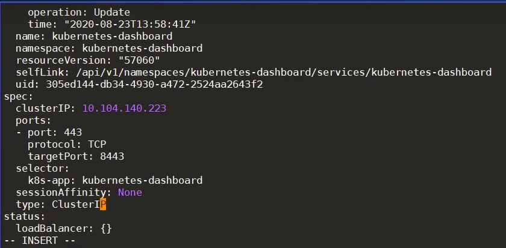
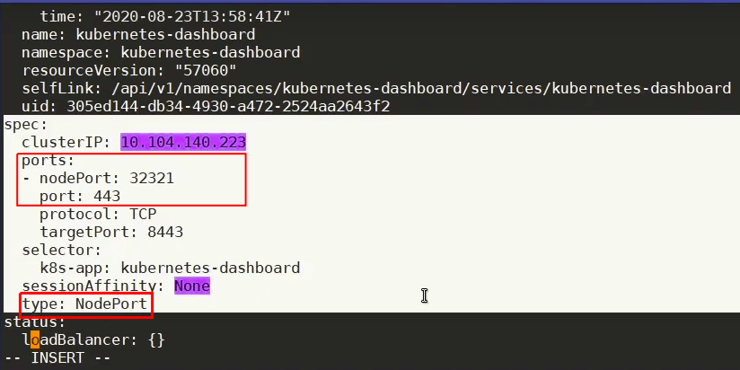
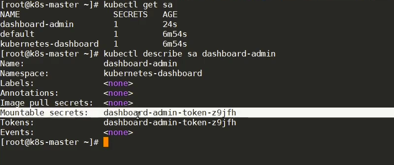
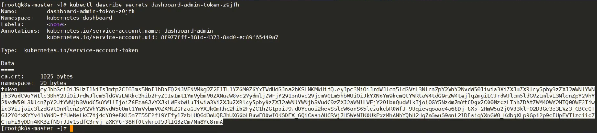

# K8s - Dashboard Setup


1. Download and deploy dashboard.yaml
   
    ```bash
    wget https://raw.githubusercontent.com/kubernetes/dashboard/v2.4.0/aio/deploy/recommended.yaml
    
    kubectl apply -f dashboard.yaml
    ```
    
2. Next step is to check all the resources by the below command

```
 kubectl get all -n kubernetes-dashboard
```

1. Change the Dashboard Service type from `ClusterIP` to `NodePort` 
   
    ```bash
    kubectl edit service/kubernetes-dashboard -n kubernetes-dashboard
    ```
    
    
    
    change to
    
     
    
    
    
2. Now, check if the service was changed successfully by giving the following command:

```bash
kubectl get svc -n  kubernetes-dashboard

NAME                        TYPE        CLUSTER-IP     EXTERNAL-IP   PORT(S)         AGE
dashboard-metrics-scraper   ClusterIP   10.96.21.33    <none>        8000/TCP        23m
kubernetes-dashboard        NodePort    10.97.169.90   <none>        443:32321/TCP   23m
```

1. Now, you can access the dashboard at `https://<Your IP>:32321`
   
    example: `https://192.168.0.124:32321`
    
2. Create a Service Account to login with **Token**:
   
    ```bash
    vim k8s-serviceaccount.yml
    
    #Add the follwing content
    
    #creating a service account with admin-users
    apiVersion: v1
    kind: ServiceAccount
    metadata:
      name: admin-user
      namespace: kubernetes-dashboard
    ---
    #Creating a Service Role Binding
    apiVersion: rbac.authorization.k8s.io/v1
    kind: ClusterRoleBinding
    metadata:
      name: admin-user
    roleRef:
      apiGroup: rbac.authorization.k8s.io
      kind: ClusterRole
      name: cluster-admin
    subjects:
    - kind: ServiceAccount
      name: admin-user
      namespace: kubernetes-dashboard
    ```
    
    Now, 
    
    ```bash
    kubectl create -f k8s-serviceaccount.yml
    ```
    
    1. After successful creation of the service account, perform the below set of commands:
    
    ```bash
    kubectl get sa -n kubernetes-dashboard
    ```
    
    ```bash
    kubectl describe sa admin-user -n kubernetes-dashboard
    ```
    
    
    
    1. Accessing the token:
    
    ```bash
    kubectl describe secrets dashboard-admin-token-z9jfh -n kubernetes-dashboard
    ```
    
    
    
    Now, copy the token and paste it on the dashboard URL to access **Dashboard**
    
    References: [https://kubernetes.io/docs/tasks/access-application-cluster/web-ui-dashboard/](https://kubernetes.io/docs/tasks/access-application-cluster/web-ui-dashboard/)
