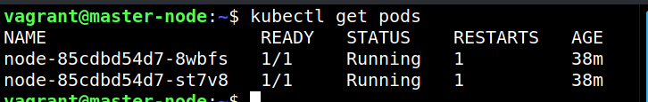

# **Private Docker Image Access Setup:**

###### pulling images from private repositories can be done in two ways:

###### Either Using command line (kubectl entirely)

```bash
kubectl create secret docker-registry copycharming-docker-credentials-secret --docker-server=DOCKER_REGISTRY_SERVER --docker-username=DOCKER_USER --docker-password=DOCKER_PASSWORD --docker-email=DOCKER_EMAIL
```

###### Or Using Docker config.json file

a. login to Docker using the following commands by entering your username & password

```bash
docker login
```

b. use the generated docker config.json file in kubernetes by credentials_names

```bash
kubectl create secret generic copycharming-docker-credentials-secret --from-file=.dockerconfigjson=/home/$user/.docker/config.json --type=kubernetes.io/dockerconfigjson
```

Now check whether secrets are working with the following command:

```bash
kubectl get secrets
```

###### Test private images pull with the configured docker secrets:

- We first create a pod file with a container name in it.
- <!--saving the file as nodeapp.yaml-->

```yaml
apiVersion: v1
kind: Pod
metadata:
  name: private-reg
spec:
  containers:
    - name: privateapp
      image: saikiranbelana/nodeapp
  imagePullSecrets:
    - name: saikiran-docker-credentials-secret
```

create pod using the above private image (nodeapp) & the secret we just created (saikiran-docker-credentials-secret):

```bash
kubectl create -f nodeapp.yaml
```

Check pods are started or not with the following command: (the command refreshes every 2 seconds and updates status accordingly)

```bash
watch kubectl get pods
```

it shows the following with status of creatingcontainer & Running:



References:

https://jamesdefabia.github.io/docs/user-guide/kubectl/kubectl_create_secret_docker-registry/

### Quick Jump:

1. [Docker](/Docker/README.md)
2. [Kubernetes](/Kubernetes/README.md)
3. [NGINX-WebServer](/NGINX-webserver-on-nodejs/README.md)
4. [Remote-SSH-VNC](/private-docker-image-secrets/README.md)
5. [Dashboard](/dashboard/README.md)
6. [private docker Images](/private-docker-image-secrets/README.md)
